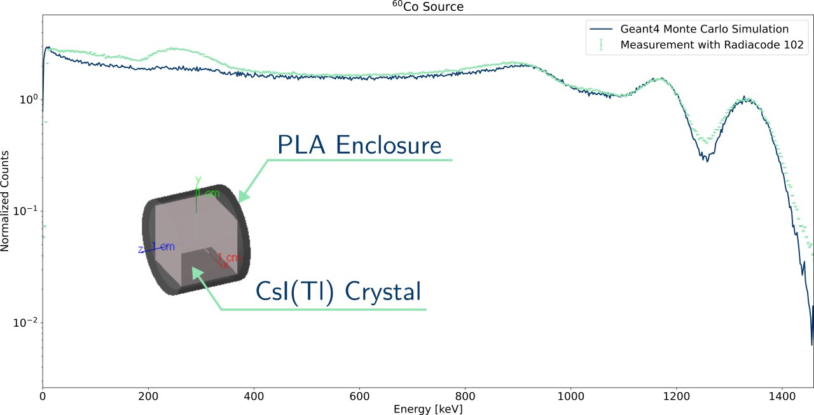

# Radiacode Digital Twin

## Introduction

A Geant4 implamentation of the scintillator crystal inside the Radiacode detector.


Comparison between experimental measurement using a <sup>60</sup>Co source and the Geant4 simulation.

To compare the Monte Carlo simulation output with laboratory measurements, the detector's FWHM calibration curve must be applied to Gaussian smearing of the output.

Discrepancies between the model and measurements in the 100-400 keV range arise from backscattering events. The simulation only includes the detector, not the surrounding environment, preventing accurate reproduction of these events.

### Prerequisites

> [!WARNING]  
> In order to correctly compile this application you need both the Geant4 libraries (v. 4.11.2) and the ROOT libraries already installed on your system. 


### Compile the application

Clone the repository using :
```bash
git clone https://github.com/lucamors/G4Radiacode.git
```

Now create a build directory inside the ```G4Radiacode``` directory:

```bash
mkdir build && cd build
```

Launch CMake :
```bash
cmake ..
```

Finally you can build the application (using <N> core):
```bash
make -j<N>
```

### Usage

The ```G4RadiacodePrimaryGenerator``` is built around the use of ```G4GeneralParticleSource``` (i.e. GPS)
and example for a <sup>60</sup>Co source you can use:
```bash
macro/examples/co60.mac
```